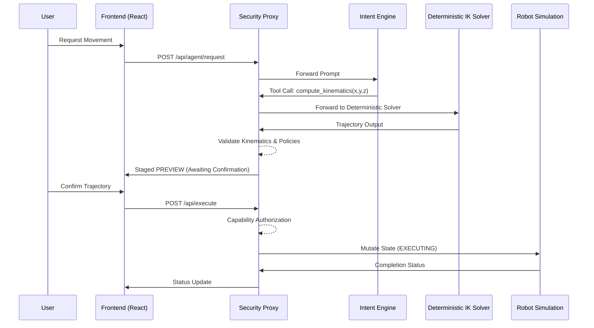
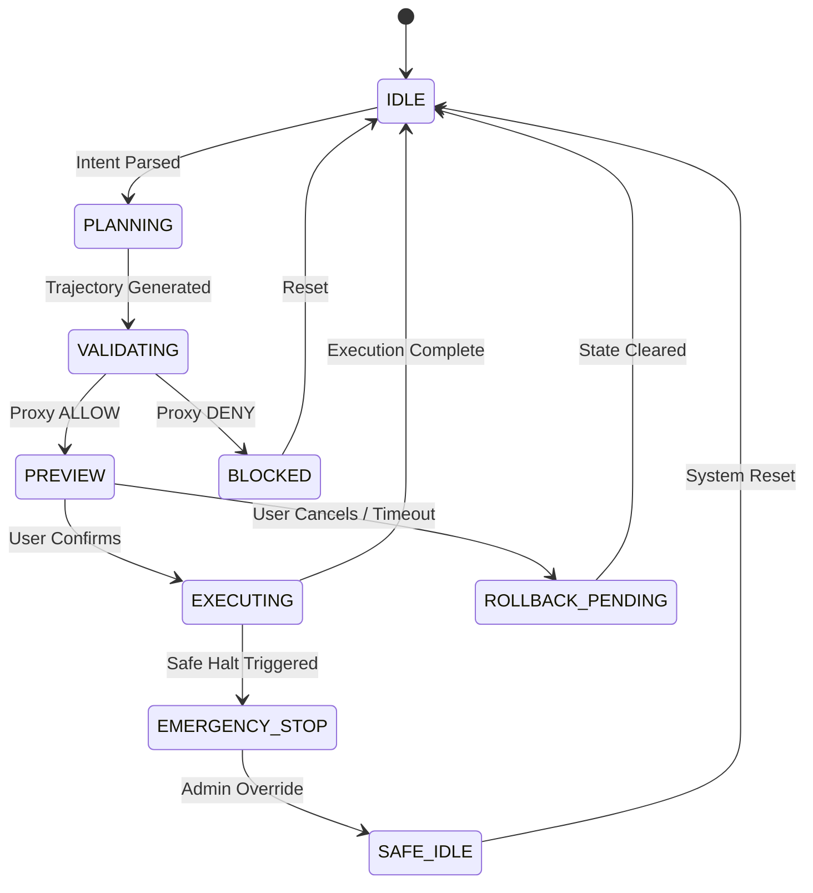

# Aegis Twin MVP: Cyber-Physical AI Safety Architecture
**Secure Agentic Digital Twin for Industrial Control**

## 1. System Overview & Core Philosophy

Aegis Twin is an engineering MVP designed to explore secure cyber-physical orchestration. Its primary objective is to allow an LLM (Gemini 1.5 Pro) to manage a simulated 3-DOF robotic arm while strictly enforcing a **zero-trust safety model** and **deterministic execution**.

The system relies on a **Stateful Interception Proxy** middleware. Crucially, the LLM is explicitly isolated from generating raw numerical commands. The LLM only parses intent, while a deterministic backend computes spatial kinematics. All proposed trajectories and tool calls must pass through the proxy for validation, capability authorization, and user confirmation before execution.

### Explicit Non-Goals (Simplifying Robotics for MVP)
To maintain project feasibility and focus entirely on secure orchestration, the following features are intentionally excluded:
- Real hardware deployment
- Advanced collision physics engines
- Multi-agent robotics or autonomous navigation
- Distributed OT networking
- ROS (Robot Operating System) dependencies

---

## 2. Deterministic Trajectory Pipeline

The architecture strictly separates intent interpretation (LLM) from numerical kinematics (Backend). The LLM must NEVER directly generate joint angles, velocity values, or raw actuator commands. 

### Execution Pipeline
1. **User Prompt:** "Move arm to coordinates x,y,z."
2. **Intent Parsing:** Gemini extracts the target coordinates.
3. **Backend Kinematics:** Deterministic backend functions (`compute_inverse_kinematics()`, `generate_safe_trajectory()`, `validate_workspace_bounds()`) compute the trajectory.
4. **Proxy Validation:** Middleware checks the trajectory against YAML policies.
5. **Trajectory Preview:** Rendered on the frontend with visual ghosting.
6. **User Confirmation:** Explicit human approval.
7. **Execution:** Simulation state mutated.
8. **Audit Logging:** Traceable execution stored.



---

## 3. Formal Operational State Machine

The robot's operational status is governed by a strict finite state machine (FSM) tracking the execution lifecycle.

### Core States
- `IDLE`: Awaiting commands.
- `PLANNING`: Backend calculating kinematics.
- `VALIDATING`: Proxy checking trajectory against policies.
- `PREVIEW`: Trajectory staged, awaiting explicit user confirmation.
- `EXECUTING`: Safely executing confirmed trajectory.
- `BLOCKED`: Trajectory DENIED or QUARANTINED by proxy.
- `ERROR`: System fault or payload error.
- `EMERGENCY_STOP`: Critical safety override engaged.

### Recovery States
- `RECOVERING`: Attempting automatic recovery.
- `ROLLBACK_PENDING`: Discarding stale or failed trajectories.
- `SAFE_IDLE`: Secure reset post-emergency.



---

## 4. Capability Isolation & Tool Permission Layers

The proxy enforces strict capability isolation. Tools are categorized by risk, preventing unauthorized tool escalation.

### Tool Categories
```python
SAFE_TOOLS = [
    "get_robot_state",
    "preview_trajectory",
    "compute_kinematics"
]

RESTRICTED_TOOLS = [
    "confirm_execution",
    "execute_trajectory"
]

SYSTEM_TOOLS = [
    "emergency_stop",
    "reset_system"
]
```

The middleware requires explicit user confirmation before executing any `RESTRICTED_TOOLS` and verifies admin clearance for `SYSTEM_TOOLS`.

### Rate Limiting & Abuse Protection
Lightweight operational protections prevent system flooding or brute-force intent overriding:
- Max prompts per minute (e.g., 20)
- Max execution confirmations per session
- Cooldown after repeated `DENY` decisions (e.g., 15s)
- Timeout on inactive `PREVIEW` state (e.g., 30s)

---

## 5. Traceability, Governance & Audit Logging

Every trajectory is tracked with immutable IDs ensuring total forensic consistency and replayability.

### Tracking Identifiers
Every executed trajectory binds the following IDs:
```json
{
  "request_id": "uuid",
  "trajectory_id": "uuid",
  "execution_id": "uuid",
  "policy_snapshot_id": "uuid"
}
```

### Policy Versioning & Governance
Policies are version-controlled. Each execution stores a snapshot ID (e.g., `v1.3.2`) to track exactly which rules authorized the execution.

```yaml
policy_id: pol_safe_velocity
policy_version: v1.3.2
created_at: 2026-05-14T00:00:00Z
severity: CRITICAL
owner: security_team
action: DENY
condition:
  type: parameter_threshold
  rules:
    - parameter: velocity
      max: 0.5
```

### Persistent Audit Record Schema
```json
{
  "request_id": "uuid",
  "execution_id": "uuid",
  "timestamp": "iso8601",
  "event_type": "PROMPT|TOOL_CALL|STATE_CHANGE|CONFIRMATION",
  "decision": "ALLOW|DENY|QUARANTINE",
  "policy_snapshot_version": "v1.3.2",
  "violated_rule": "pol_safe_velocity|null",
  "execution_lifecycle": "VALIDATED",
  "payload_hash": "sha256"
}
```

---

## 6. Failure Recovery & Safe Halt Logic

Explicit recovery workflows ensure the robot fails predictably and recovers safely.

### Required Behaviors
- **Rollback:** Invalid executions or stale previews are cleanly rolled back to IDLE.
- **Connection Recovery:** Re-establishing WebSocket state upon disconnects.
- **Proxy Timeout Handling:** Aborting operations when the LLM/Solver hangs.

### Emergency Stop (E-Stop) Workflow
1. Instantly halt all execution.
2. Freeze simulation state.
3. Emit high-priority audit event to SQLite and WebSockets.
4. Transition robot to `EMERGENCY_STOP`.
5. Lock all execution controls until explicit `SAFE_IDLE` admin reset.

---

## 7. Frontend Execution Observability

The frontend provides real-time security observability and distinct states.

### Execution Monitoring & Trajectory Preview
- **Preview Visuals:** Ghost-arm rendering with dashed path projection.
- **Timer:** Preview countdown timer before auto-rollback.
- **Execution UI:** Explicit `CONFIRM` / `CANCEL` buttons, active execution IDs, and current FSM state.
- **Emergency Visuals:** If E-STOP occurs, the visualization freezes, flashes RED, displays the triggering rule, and locks controls.

### Security Analytics Dashboard
Leveraging the SQLite audit database, the frontend displays:
- Total blocked requests / quarantined prompts.
- Most frequently triggered policies.
- Average validation latency.
- Execution success rate & throughput.

---

## 8. Clean Modular Folder Structure

```text
aegis-twin-mvp/
├── frontend/
│   ├── src/
│   │   ├── components/       # ChatUI, TraceabilityPanels, Analytics
│   │   ├── visualizer/       # Ghosting, Path Projection
│   │   └── App.jsx
├── backend/
│   ├── api/                  # Execution pipeline & Traceability endpoints
│   ├── kinematics/           # Deterministic Planar IK Solvers
│   ├── sim_core/             # FSM, State Manager
│   ├── middleware/           # Stateful Proxy
│   │   ├── interceptor.py    # Capability Isolation & Rate Limiting
│   │   ├── policy_engine.py  # Governance & Versioning
│   │   └── audit_logger.py   # SQLite persistence
│   ├── agent/                # Gemini Intent Extraction
│   └── main.py
└── data/
    ├── policies/             # Version-controlled YAML policies
    └── audit.sqlite3         # Traceable Audit DB
```

---

## 9. API Contracts & Traceability Endpoints

- `POST /api/v1/preview_trajectory`: Deterministic IK calculation. Returns `trajectory_id`.
- `POST /api/v1/confirm_execution`: Starts movement. Requires `trajectory_id` and `execution_id`.
- `GET /api/v1/analytics/metrics`: Serves security metrics to the frontend dashboard.
